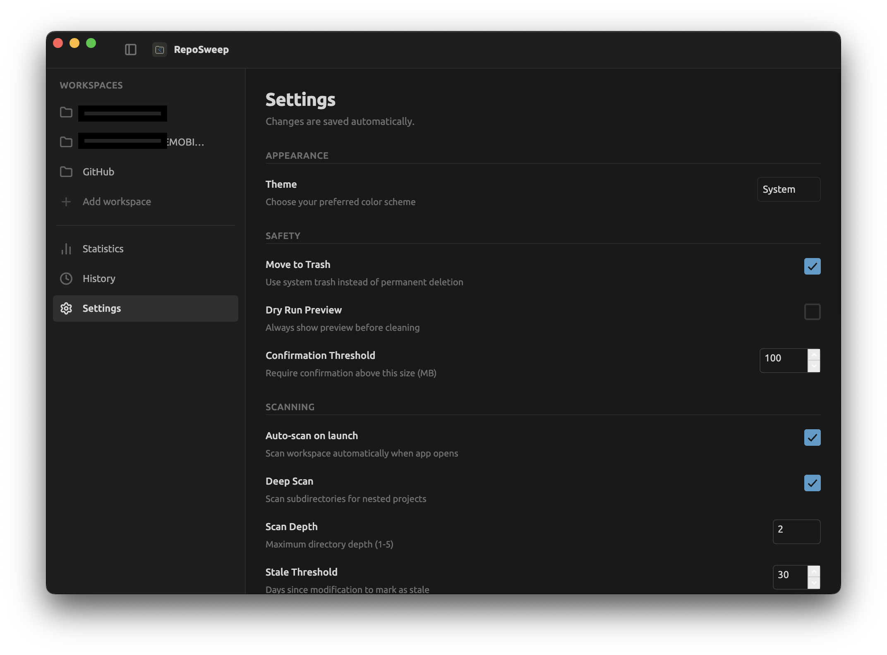

# Repo Sweep

A desktop utility for cleaning up development workspace cache folders. Built with [Sciter.js](https://sciter.com/).



## What is Repo Sweep?

Repo Sweep helps developers reclaim disk space by scanning workspace directories and identifying safe-to-delete cache folders, build artifacts, and dependency directories. It detects project types automatically and presents cleanup targets in an easy-to-use interface.

## Features

- **Safe by Default** – No automatic scanning on first launch; no source code deletion
- **Stack Aware** – Automatically detects project types:
  - Node.js (package.json)
  - Flutter (pubspec.yaml)
  - Rust (Cargo.toml)
  - Python (pyproject.toml, requirements.txt)
  - Git repositories
  - Unknown/generic projects
- **Smart Target Detection** – Identifies safe cleanup targets per project type:
  - Node: `node_modules`, `.next`, `.nuxt`, `.turbo`, `.cache`, `dist`, `build`
  - Flutter: `.dart_tool`, `build`
  - Rust: `target`
  - Generic: `.cache`, `dist`, `build`, `out`, `.output`
- **Reclaim Space Fast** – Projects sorted by reclaimable size; biggest wins first
- **Multiple Workspaces** – Add and manage multiple workspace roots
- **Filtering & Search** – Filter by project type or search by name/path
- **Multi-Page Navigation** – Dedicated pages for workspace, settings, history, and stats

## Installation

### Prerequisites

- [Sciter SDK](https://sciter.com/download/)
- Sciter runtime installed on your system

### Running

```bash
# Clone or navigate to the project
cd reposweep

# Run with Sciter
sciter main.htm

# Or use the provided script
./run.sh
```

## Usage

1. **Launch** Repo Sweep
2. **Add a workspace root** – Click "Pick a folder" to add a directory containing your projects
3. **Scan** – Select a root and click "Start scan"
4. **Review** – Browse detected projects and see reclaimable space
5. **Clean** – Click "Clean" on any project to remove its cache folders

### Navigation

- **Landing** – Select workspace roots and start scans
- **Workspace** – View projects, filter, search, and clean
- **Settings** – Configure preferences, themes, exclusions
- **History** – View cleanup history and restore from trash
- **Stats** – Analytics and space usage insights

### Quick Tips

- Use "Find likely workspaces" to auto-discover common directories (`~/Documents`, `~/Developer`, `~/Projects`, etc.)
- Filter by project type using the dropdown
- Search projects by name, path, or type
- Projects are sorted by reclaimable size (largest first)

## How It Works

1. **Scanning** – Repo Sweep iterates through immediate subdirectories of your chosen workspace root
2. **Detection** – Each directory is analyzed for project markers (package.json, Cargo.toml, etc.)
3. **Analysis** – Safe cleanup targets are identified and sized
4. **Presentation** – Results displayed in a sortable, filterable grid
5. **Cleanup** – On confirmation, target directories are recursively deleted

## Safety

- Only specific cache/build directories are targeted
- Source code is never touched
- Confirmation required before any deletion
- No background scanning or automatic cleanup

## Project Structure

```
reposweep/
├── main.htm          # Application entry point
├── main.js           # Bootstrap
├── app.js            # Main Application component (state management, routing integration)
├── routes.js         # Router component and navigation utilities
├── scanner.js        # File system scanning and cleanup logic
├── selectors.js      # UI input components (FolderSelector, FileSelector)
├── settings.js       # State persistence
├── pages/            # Page components (one per route)
│   ├── index.js      # Page exports
│   ├── landing.js    # LandingPage – workspace selection
│   ├── workspace.js  # WorkspacePage – project grid and cleanup
│   ├── settings.js   # SettingsPage – preferences and configuration
│   ├── history.js    # HistoryPage – cleanup log
│   ├── stats.js      # StatsPage – analytics and insights
│   └── project-detail.js # ProjectDetailPage – individual project view
├── ui/               # Shared UI components
│   ├── project-card.js   # Individual project card component
│   └── titlebar.js   # Window title bar
├── styles/
│   ├── tokens.css    # Design tokens (colors, typography, spacing)
│   ├── components.css # Button, input, badge components
│   ├── chrome.css    # Window chrome styling
│   └── app.css       # Layout and page-specific styles
└── icon.svg          # Application icon
```

## Development

### Tech Stack

- [Sciter.js](https://sciter.com/) – Desktop UI framework
- [Sciter Reactor](https://sciter.com/docs/reactor) – Built-in React-like component system
- CSS3 – Styling with Sciter extensions
- Vanilla JavaScript (ES6+ modules)

### Key Components

- **Application** (`app.js`) – Central state management, event handling, routing integration
- **Router** (`routes.js`) – Page navigation using Sciter Reactor patterns
- **scanner** (`scanner.js`) – File system operations, project detection
- **Pages** (`pages/`) – Individual route components (Landing, Workspace, Settings, etc.)

### Routing

Repo Sweep uses Sciter Reactor's routing pattern for navigation:

```js
// Navigate programmatically
import { navigateTo } from "routes.js";
navigateTo("workspace");
navigateTo("settings");

// Navigate via links
<a href="route:settings">Settings</a>
```

## License

MIT License – See LICENSE file for details

## Contributing

Contributions welcome! Please ensure your changes maintain compatibility with the Sciter.js runtime.

---

Built with Sciter.js
